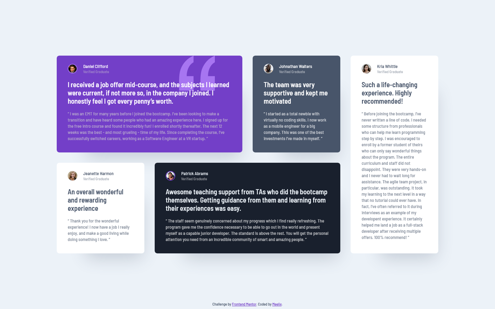

# Frontend Mentor - Testimonials grid section solution

This is a solution to the [Testimonials grid section challenge on Frontend Mentor](https://www.frontendmentor.io/challenges/testimonials-grid-section-Nnw6J7Un7). Frontend Mentor challenges help you improve your coding skills by building realistic projects.

## The challenge

Users should be able to:

- [x] View the optimal layout for the site depending on their device's screen size

## Screenshot

## Links

- [Solution URL](https://www.frontendmentor.io/solutions/testimonials-grid-section-RhdEf6rY9-)
- [Live Site URL](https://meelix.github.io/frontendmentor-testimonial-grid)

## Built with

- Native css nesting
- Css grid
- Mobile-first workflow
